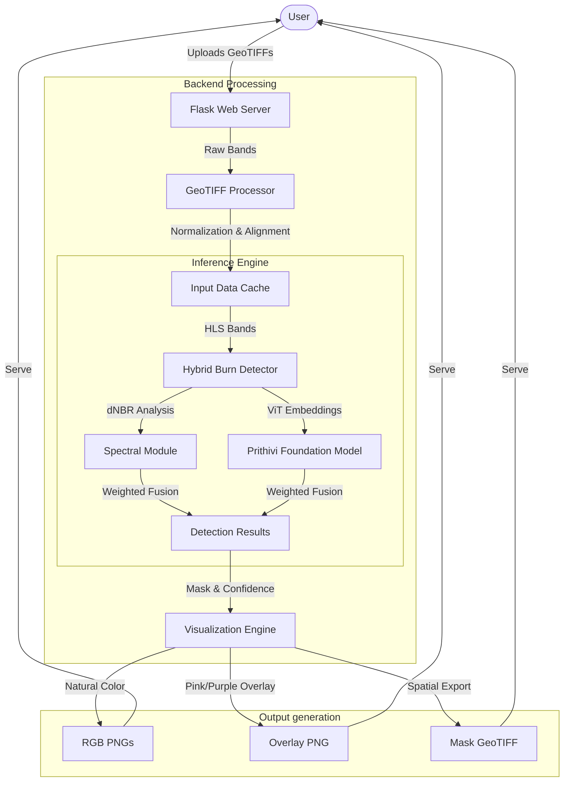
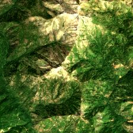
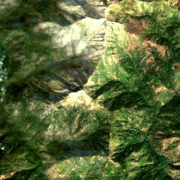
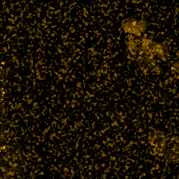
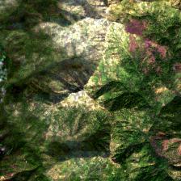
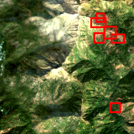

# FireWatch: Wildfire Damage Detection with Prithivi-EO-2.0

FireWatch is a specialized geospatial analysis tool built on top of IBM and NASA's **Prithivi-EO-2.0-300M** foundation model. It is designed to detect and quantify wildfire damage by comparing pre and post-event satellite imagery using a hybrid approach that combines classical spectral indices with deep learning embeddings.

## 🏗️ Architecture



## ✨ Features

- **Hybrid Detection Engine**: Combines **dNBR** (delta Normalized Burn Ratio) with **Prithivi-EO-2.0** spatial embeddings for high-precision burn mapping.
- **Zero-Shot Capability**: Leverages the power of foundation models to detect damage without needing specific training for every fire event.
- **GeoTIFF Native**: Full support for 6-band HLS (Harmonized Landsat Sentinel) format, preserving geospatial metadata throughout the pipeline.
- **Enhanced Visualization**:
  - Natural Color RGB previews.
  - **New!** Pink/Purple high-contrast damage overlays for better visibility on satellite backgrounds.
  - **New!** Red bounding boxes (Squares) for automated target identification.
- **Spatial Export**: Results can be downloaded as georeferenced TIFs for immediate use in GIS software like QGIS or ArcGIS.
- **CPU-Optimized**: Engineered to run efficiently on standard CPU environments using `terratorch` and `torch` optimizations.

## 🎞️ Visual Showcase (Example Results)

The following imagery demonstrates the end-to-end detection process on a real satellite image pair (unknown area).

### 🌓 Input Comparison

|                  Pre-Event                   |                   Post-Event                   |
| :------------------------------------------: | :--------------------------------------------: |
|  |  |
|       _Satellite view before the fire_       |  _Satellite view after the fire (burn scars)_  |

### 📊 Detection Outputs

|                   Change Mask                   |                  Pink/Purple Overlay                  |                 Red Boxed Detection                  |
| :---------------------------------------------: | :---------------------------------------------------: | :--------------------------------------------------: |
|  |  |  |
|        _Raw AI Detection (Binary Mask)_         |             _Enhanced Composite Overlay_              |          _Automated Cluster Identification_          |

---

## 📊 Detailed Output Breakdown

FireWatch generates several distinct visual and data products for comprehensive analysis:

### 1. 👺 Change Mask (`*_mask.png`)

A binary representation of the detected areas. This is the pure mathematical output of the hybrid model, highlighting exactly which pixels have undergone significant spectral and contextual shifts typical of fire damage.

### 2. 🎆 Pink/Purple Overlay (`*_overlay.png`)

A high-contrast visualization designed for human interpretation. By using a **Pink/Purple** spectrum on top of the original imagery, it provides superior visibility compared to standard red masks, especially over dark, charred forest backgrounds.

### 3. 🟥 Red Boxed Detection (`*_boxed.png`)

Integrated automated target identification. Using connected-component analysis, the tool draws sharp **red squares (bounding boxes)** around every distinct damage cluster. This is ideal for rapid assessment and prioritizing area-based responses.

---

## 🚀 Getting Started

### Prerequisites

- Python 3.10+
- [UV Package Manager](https://astral.sh/uv/) (recommended for speed and reliability)

### Installation

1.  **Clone the repository**:

    ```bash
    git clone https://github.com/your-username/Changedetection-prithivi2.0.git
    cd Changedetection-prithivi2.0
    ```

2.  **Install dependencies**:

    ```bash
    uv sync
    ```

3.  **Run the application**:
    ```bash
    uv run python app.py
    ```

### ⚡ Quick Start with Public Demo Data

FireWatch includes a public satellite data example to help you test the detection pipeline immediately:

1.  Start the server using `uv run python app.py`.
2.  Open `http://localhost:5000` in your browser.
3.  Upload the following files from the project directory:
    - **Pre-Event**: `demo_data/real/pre.tif`
    - **Post-Event**: `demo_data/real/post.tif`
4.  Set the **Threshold** to `0.5` for best clarity on this dataset.
5.  Click **"Detect Changes"** and wait for the AI to process the results.

## 🛰️ Data Specifications

For optimal results, input GeoTIFFs should follow the HLS (Harmonized Landsat Sentinel) band specification:

| Band Index | Band Name | Wavelength | Purpose                                     |
| :--------- | :-------- | :--------- | :------------------------------------------ |
| 1          | Blue      | B02        | Natural Color / Atmospheric Check           |
| 2          | Green     | B03        | Natural Color / Vegetation                  |
| 3          | Red       | B04        | Natural Color / Soil                        |
| 4          | NIR       | B8A        | Vegetation Health (NBR calculation)         |
| 5          | SWIR 1    | B11        | Moisture / Burn Detection (NBR calculation) |
| 6          | SWIR 2    | B12        | Burn Scars / Soil Composition               |

> [!IMPORTANT]
> Both "Pre" and "Post" images must be spatially aligned (same CRS, bounds, and dimensions).

## 🧪 Hybrid Detection Logic

FireWatch doesn't just look for "change"—it looks for _fire damage_. The detection pipeline uses a weighted fusion:

1.  **Spectral Evidence (70%)**: Calculates the `dNBR = NBR_pre - NBR_post`, where `NBR = (NIR - SWIR2) / (NIR + SWIR2)`. This is the gold standard for identifying charred organic matter.
2.  **Contextual Evidence (30%)**: Uses the Prithivi ViT (Vision Transformer) to extract 1024-dimensional embeddings. It calculates the cosine distance between temporal features to understand the _shape_ and _context_ of land cover change.

This reduces false positives caused by clouds, shadows, or seasonal vegetation changes.

## 🌍 Open Satellite Data Sources

Since FireWatch is designed for the **NASA HLS** standard, you can download more public imagery from these official sources:

1.  **NASA Earthdata Search**: Access [HLS L30 (Landsat)](https://search.earthdata.nasa.gov/search?q=HLSL30) and [HLS S30 (Sentinel)](https://search.earthdata.nasa.gov/search?q=HLSS30) global datasets.
2.  **USGS EarthExplorer**: High-resolution [Landsat 8-9](https://earthexplorer.usgs.gov/) products compatible with HLS.
3.  **Microsoft Planetary Computer**: Browse and stream [HLS Collections](https://planetarycomputer.microsoft.com/dataset/hls) using Python/STAC.

## 📄 License

This project is licensed under the Apache 2.0 License - see the [LICENSE](LICENSE) file for details. Built using Prithvi-EO-2.0 models by IBM Research and NASA.

---

Built with ❤️ for Earth Observation.
